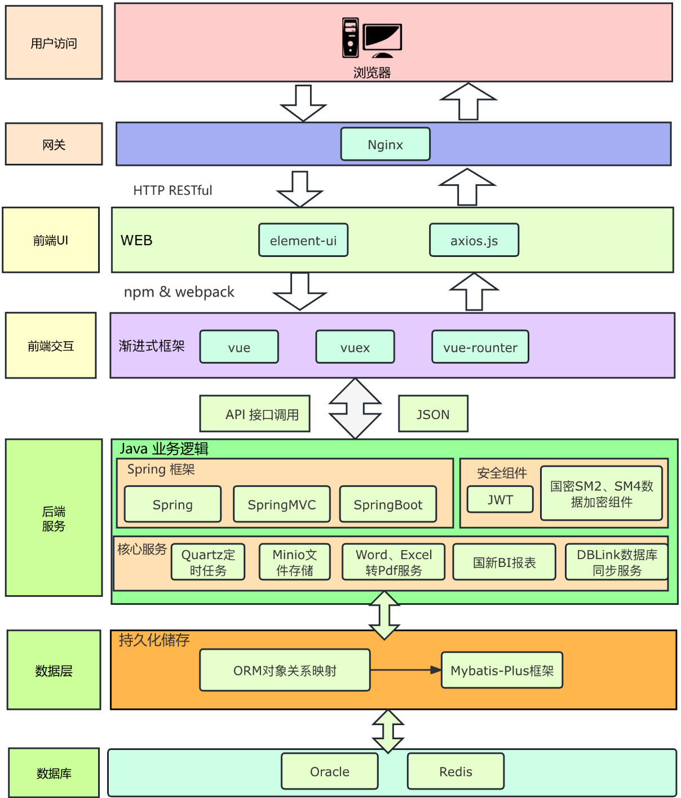

# 1.前端、后端、数据库的交互与企业级系统技术链

## 1.1 前端、后端、数据库的交互原理

可以将三者的关系类比为 **餐厅点菜**：
- **前端**：菜单 + 服务员（与用户交互，展示页面）
- **后端**：厨师 + 出餐台（接收点单、处理业务逻辑）
- **数据库**：仓库（存储原材料，即数据）

### 1.1.1 交互流程（HTTP 请求模型）
1. **用户在前端操作**
   - 前端（浏览器、App、小程序等）采集用户输入（如登录、搜索）。
   - 前端通过 **HTTP/HTTPS 请求** 向后端 API 发送数据。

2. **后端接收并处理请求**
   - 后端（Java、Python、Node.js、.NET 等开发）接收请求。
   - 根据业务逻辑决定是否访问数据库。

3. **后端访问数据库**
   - 使用 **数据库驱动/ORM**（JDBC、MyBatis、SQLAlchemy 等）发送 SQL 查询或调用存储过程。
   - 数据库处理并返回结果集。

4. **后端返回数据给前端**
   - 后端将数据封装为 JSON、XML 或 HTML。
   - 通过 HTTP 响应返回前端。

5. **前端展示数据**
   - 前端解析数据并渲染页面（Vue、React 等）。
   - 用户看到最终结果。

### 1.1.2 交互示意图

---

## 1.2 企业级系统技术链

企业级系统通常采用 **分层架构** 与多种技术协作，保证 **稳定性、可扩展性、安全性**。

### 1.2.1 前端层（展示与交互）
- **Web端**：HTML、CSS、JavaScript（React、Vue、Angular）
- **移动端**：Android（Kotlin/Java）、iOS（Swift）、Flutter、React Native
- **桌面端**：Electron、WPF、JavaFX
- **常用技术**：
  - UI 框架：Element Plus、Ant Design、Bootstrap
  - 数据交互：Axios、Fetch API、WebSocket

### 1.2.2 后端层（业务逻辑 + API 服务）
- **语言/框架**：
  - Java（Spring Boot / Spring Cloud）
  - Python（Django / Flask / FastAPI）
  - JavaScript/TypeScript（Node.js + Express / NestJS）
  - .NET（ASP.NET Core）
- **职责**：
  - 接收前端请求
  - 数据验证与权限控制
  - 执行业务逻辑
  - 调用数据库 / 缓存 / 消息队列
  - 返回结果
- **接口协议**：
  - RESTful API（JSON）
  - GraphQL
  - gRPC

### 1.2.3 数据存储层
- **关系型数据库**：MySQL、PostgreSQL、Oracle、SQL Server
- **非关系型数据库**：Redis（缓存）、MongoDB（文档）、Elasticsearch（搜索）
- **数据仓库/大数据**：Hive、ClickHouse、Hadoop、Spark

### 1.2.4 中间件 / 基础设施
- **缓存**：Redis、Memcached
- **消息队列**：Kafka、RabbitMQ、RocketMQ
- **API 网关**：Nginx、Kong、Spring Cloud Gateway
- **日志监控**：ELK、Prometheus + Grafana

### 1.2.5 安全与权限
- 单点登录（SSO）
- OAuth2 / JWT 鉴权
- 数据加密（SSL/TLS、AES、RSA）

### 1.2.6 运维与部署
- **容器化**：Docker、Kubernetes（K8s）
- **持续集成/部署（CI/CD）**：Jenkins、GitLab CI、GitHub Actions
- **云服务**：阿里云、腾讯云、华为云、AWS、Azure、GCP

---
